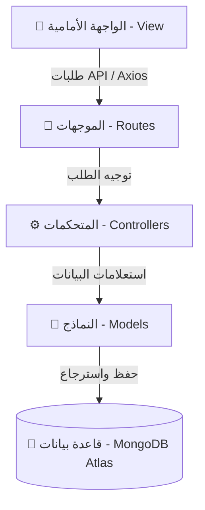

# 🪙 مشروع المحاسب الشخصي - Personal Accountant

> **مشروع تخرج متميز لإدارة المعاملات المالية الشخصية، الميزانيات الذكية، أهداف الادخار، وتقارير التحليل المالي بصورة ديناميكية وتفاعلية بالكامل.**

---

## 📖 جدول المحتويات (Table of Contents)
1. [عن المشروع (About the Project)](#-عن-المشروع-about-the-project)
2. [الهيكل المعماري للنظام (Architecture & MVC Pattern)](#-الهيكل-المعماري-للنظام-architecture--mvc-pattern)
3. [التقنيات المستخدمة (Tech Stack)](#-التقنيات-المستخدمة-tech-stack)
4. [أبرز الميزات والحلول المبتكرة (Key Features & Innovation)](#-أبرز-الميزات-والحلول-المبتكرة-key-features--innovation)
5. [طريقة التثبيت والتشغيل (Installation & Setup)](#-طريقة-التثبيت-والتشغيل-installation--setup)
6. [الترقيات واللمسات الفنية الأخيرة (Recent Upgrades)](#-الترقيات-واللمسات-الفنية-الأخيرة-recent-upgrades)

---

## 💡 عن المشروع (About the Project)
منصة **المحاسب الشخصي** هي تطبيق ويب متكامل صُمم لمساعدة الأفراد على تنظيم شؤونهم المالية بكفاءة وعلمية. يتيح التطبيق للمستخدمين تسجيل معاملاتهم اليومية من دخل ومصروفات، وربطها بميزانيات شهرية مخصصة، ومراقبة أهداف ادخارهم الذاتية، مع تقديم تقارير تفصيلية ورسوم بيانية توضح بنية الصرف ومصادره، بالإضافة لـ منتدى تفاعلي (Forum) لمشاركة النصائح والخبرات المالية.

---

## 🏗️ الهيكل المعماري للنظام (Architecture & MVC Pattern)
يتبع المشروع معمارية **MVC (Model-View-Controller)** لضمان فصل المهام (Separation of Concerns) وسهولة التوسع والصيانة:



* **Models (النماذج):** هيكلة وتوثيق البيانات في قاعدة بيانات MongoDB عبر Mongoose (User, Budget, Goal, Transaction, Notification, Post).
* **Views (الواجهات):** واجهات مستخدم متجاوبة (RTL) مبنية بأسلوب Glassmorphism التفاعلي مدعومة بمؤثرات جزيئية ثلاثية الأبعاد (Three.js) ورسوم بيانية حية (Chart.js).
* **Controllers (المتحكمات):** معالجة المنطق الحسابي والمالي الدقيق وتوليف التقارير.

---

## 🛠️ التقنيات المستخدمة (Tech Stack)
* **Backend:** Node.js, Express.js
* **Database:** MongoDB Atlas (Mongoose ODM)
* **Authentication:** JSON Web Tokens (JWT), Bcrypt encryption
* **Push Notifications:** Firebase Admin SDK
* **Task Scheduling:** Node-Schedule (Cron jobs)
* **Frontend:** Vanilla HTML5, Premium CSS3 Custom Variables, JavaScript ES6
* **Visual Libraries:** Three.js (3D Particle Backgrounds), Chart.js (Interactive Charts), FontAwesome (Iconography)

---

## 🌟 أبرز الميزات والحلول المبتكرة (Key Features & Innovation)

### 📊 المزامنة والترابط المالي التلقائي (Programmatic Financial Sync)
* **ربط المعاملات بالميزانية:** عند إضافة أي مصروف وتوجيهه لبند ميزانية محدد، يتم تحديث الميزانية فوراً بجمع المصروفات الفعلية ومقارنتها بالقيمة المخصصة.
* **التحذير التلقائي:** يتم إطلاق إشعار تحذيري للمستخدم فور تجاوز المصروفات للقيمة المحددة للبند.
* **التحكم بالمعاملات الحالية:** في حال قيام المستخدم بتحديث قيمة أي معاملة أو حذفها، يقوم النظام تلقائياً وبدقة رياضية بإعادة احتساب الفروقات وخصمها من الميزانية أو هدف الادخار المقابل لحماية نزاهة وتكامل البيانات.

### 🎨 واجهة مستخدم زجاجية فائقة الجمال (Glassmorphism & UX Aesthetics)
* تصميم عصري يعتمد على التمويه الزجاجي الخلفي (`backdrop-filter`) وظلال وهج النيون المتفاعلة مع تحويم الماوس والوضع الداكن والفاتح.
* زر تفاعلي لإظهار وإخفاء كلمات المرور في حقول المصادقة لسهولة الاستخدام على الهواتف والأجهزة اللوحية.

---

## 🚀 طريقة التثبيت والتشغيل (Installation & Setup)

### 📋 المتطلبات الأساسية
* وجود **Node.js** مثبت على جهازك (الإصدار 16 أو أحدث).
* حساب على **MongoDB Atlas** أو خادم محلي لـ MongoDB.

### ⚙️ خطوات التشغيل

1. **نسخ المستودع (Clone Repository):**
   ```bash
   git clone https://github.com/abdofull/personal-collge.git
   cd personal-collge
   ```

2. **تثبيت الحزم البرمجية (Install Dependencies):**
   ```bash
   npm install
   ```

3. **إعداد متغيرات البيئة (Configure Environment):**
   * قم بإنشاء ملف `.env` في المجلد الرئيسي للمشروع بناءً على ملف `.env.example`:
   ```env
   PORT=8000
   MONGO_URL=mongodb+srv://<username>:<password>@cluster.mongodb.net/dbname
   JWT_SECRET=your_jwt_secret_key
   ```

4. **تشغيل التطبيق في وضع التطوير (Run Dev Server):**
   ```bash
   npm run dev
   ```

5. **زيارة الموقع:**
   * افتح المتصفح وتوجه إلى: `http://localhost:8000/login.html`

---

## ✨ الترقيات واللمسات الفنية الأخيرة (Recent Upgrades)
تم إصلاح وتحسين العديد من النقاط الجوهرية في المشروع ليصبح جاهزاً للتقييم النهائي بأعلى جودة:
* **تجاوز مشكلة DNS SRV:** حل مشكلة فشل الاتصال بقواعد بيانات أطلس عبر الأجهزة المحلية باستخدام موجهات Google DNS برمجياً داخل خادم قواعد البيانات.
* **إصلاح عمليات تسجيل الخروج:** فصل مسار تسجيل الخروج الفعلي عن حذف الحساب الذي كان يسبب خللاً عند المغادرة.
* **مزامنة البيانات المالية الحية:** تعشيق عمليات الحذف والتعديل للمعاملات الرياضية لتعود بأثر رجعي فوري على أهداف الادخار وبنود الميزانية بشكل متزامن دقيق.
* **تحسين المرفقات والصور:** إصلاح مسارات تخزين الصور والرمزيات لتصبح مسارات ويب نسبية خالية من أخطاء الـ 404.
* **الترقية الجمالية الشاملة:** دمج أزرار العين التفاعلية وتصميمات البطاقات الزجاجية المتوهجة في أوضاع الإضاءة المختلفة.

---

### 👨‍💻 مطور المشروع (Developer)
**عبدالرحمن صلاح الطوير (Abdulrahman Salah Altwar)**  
*أتمنى لكم استعراضاً ممتعاً للمشروع في المعرض!*
